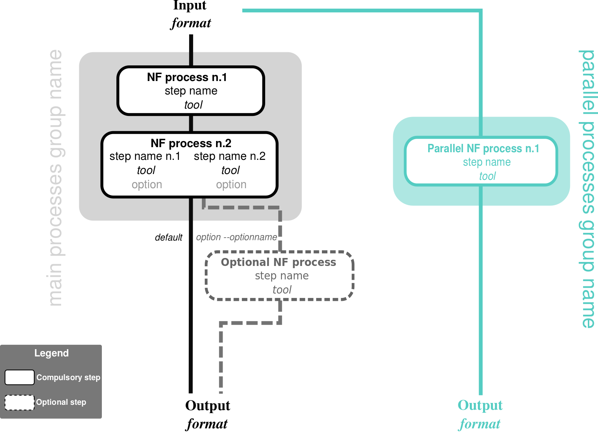

# Nextflow VCF Intersection Pipeline

[](https://circleci.com/gh/IARCbioinfo/template-nf)
[](https://hub.docker.com/r/iarcbioinfo/template-nf/)
[](https://singularity-hub.org/collections/1404)
[](https://zenodo.org/badge/latestdoi/94193130)



## Description
This Nextflow pipeline performs the intersection of VCF files using bcftools. It takes genomic VCF files (for example from Mutect and Strelka), extracts SNVs from Mutect, intersects Mutect and Strelka for indels and multinucleotide polymorphisms (MNPs), and creates a concatenated, indexed VCF file containing Mutect SNPs and intersected indels/MNPs.

## Dependencies

1. This pipeline is based on [Nextflow](https://www.nextflow.io). Please refer to the [IARC-nf](https://github.com/IARCbioinfo/IARC-nf) repository for installation, basic usage, and configuration information for Nextflow and our pipelines.
2. External software:
   - bcftools
   - tabix

You can avoid installing all the external software by only installing Docker. See the [IARC-nf](https://github.com/IARCbioinfo/IARC-nf) repository for more information.

## Input
| Type      | Description     |
|-----------|-----------------|
| VCF Folder (Mutect)    | Path to the folder containing Mutect VCF files |
| VCF Folder (Strelka)    | Path to the folder containing Strelka VCF files |

Specify the location of the input VCF files from Mutect and Strelka.

## Parameters

* #### Mandatory
| Name      | Example value | Description     |
|-----------|---------------|-----------------|
| --vcfFolderMutect    |     /path/to/mutect/vcf/files        | Path to the folder containing Mutect VCF files |
| --vcfFolderStrelka    |     /path/to/strelka/vcf/files        | Path to the folder containing Strelka VCF files |
| --outputFolder    |     /path/to/output/folder        | Path to the output folder |

* #### Optional
| Name      | Default value | Description     |
|-----------|---------------|-----------------|
| --vcfSuffixMutect   | _filtered_PASS_norm.vcf.hg38_multianno.vcf.gz | Suffix of Mutect VCF files |
| --vcfSuffixStrelka    | somatic.snvs_norm.vcf.hg38_multianno.vcf.gz | Suffix of Strelka VCF files |

* #### Flags

Flags are special parameters without a value.

| Name      | Description     |
|-----------|-----------------|
| --help    | Display help |

## Usage
```bash
nextflow run vcf-intersection.nf --vcfFolderMutect /path/to/mutect/vcf/files --vcfFolderStrelka /path/to/strelka/vcf/files --outputFolder /path/to/output/folder
```

##
