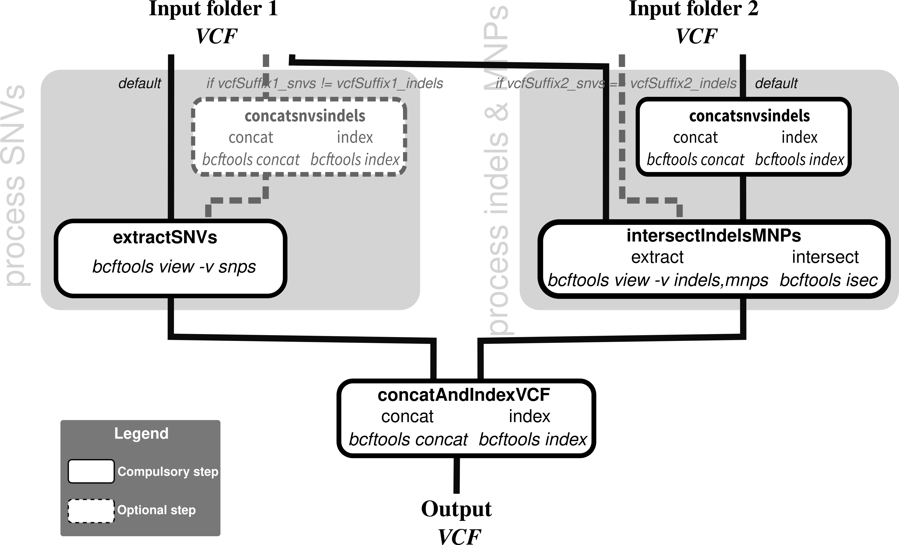

# Nextflow VCF Intersection Pipeline

[](https://hub.docker.com/r/iarcbioinfo/vcf-isec-nf/)



## Description
This Nextflow pipeline performs the intersection of VCF files using bcftools used in [Mangiante et al. 2023](https://www.nature.com/articles/s41588-023-01321-1). It takes genomic VCF files (for example from Mutect and Strelka), extracts SNVs from the first caller, intersects results from the two callers for indels and multinucleotide polymorphisms (MNPs), and creates a concatenated, indexed VCF file containing SNPs from variant caller 1 and intersected indels/MNPs.

## Dependencies

1. This pipeline is based on [Nextflow](https://www.nextflow.io). Please refer to the [IARC-nf](https://github.com/IARCbioinfo/IARC-nf) repository for installation, basic usage, and configuration information for Nextflow and our pipelines.
2. External software:
   - bcftools

You can avoid installing all the external software by only installing Docker. See the [IARC-nf](https://github.com/IARCbioinfo/IARC-nf) repository for more information.

## Input
| Type      | Description     |
|-----------|-----------------|
| input_folder1    | Path to the folder containing VCF files (e.g., outputs from IARCbioinf/mutect2-nf) |
| input_folder2    | Path to the folder containing other VCF files (e.g., from IARCbioinf/strelka2-nf)|

## Parameters

* #### Optional
| Name      | Default value | Description     |
|-----------|---------------|-----------------|
| --output_folder    |     output/        | Path of the output folder |
| --vcfSuffix1_snvs   | _filtered_PASS_norm.vcf.hg38_multianno.vcf.gz | Suffix of first SNV VCF files |
| --vcfSuffix1_indels | _filtered_PASS_norm.vcf.hg38_multianno.vcf.gz | Suffix of first indel VCF files |
| --vcfSuffix2_snvs   | .somatic.snvs_norm.vcf | Suffix of second SNV VCF files |
| --vcfSuffix2_indels | .somatic.indels_norm.vcf | Suffix of second indel VCF files |

Of note, if SNV and indel suffixes for the first or second set of VCFs are different, they are first merged; for example, by default strelka snv and indel VCFs are merged but mutect VCFs are assumed to contain all types of variants.

* #### Flags

Flags are special parameters without a value.

| Name      | Description     |
|-----------|-----------------|
| --help    | Display help |

## Usage
```bash
nextflow run IARCbioinfo/VCF-isec-nf --input_folder1 Mutect_results/ --input_folder2 strelka_results/ --outputFolder Mutect_strelka_intersection
```

